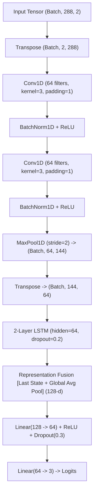

# CGMacros Model Training & Comprehensive Evaluation Report

**Dataset**: CGMacros — Personalized Nutrition and Diet Monitoring (PhysioNet [10.13026/3z8q-x658](https://doi.org/10.13026/3z8q-x658))  
**Auditor / ML Engineer**: Antigravity Machine Learning Research Agent  
**Date**: September 2026  
**Status**: Training & Evaluation Completed — Locked Research Checkpoint  
**Target Document**: `docs/CGMACROS_TRAINING_REPORT.md`  

---

> [!CAUTION]
> **INVESTIGATIONAL RESEARCH NOTICE**:  
> The models trained and evaluated in this report (`models/cgmacros_cnn_lstm_A.pt` and `models/cgmacros_cnn_lstm_B.pt`) are strictly exploratory machine learning research prototypes developed for algorithmic benchmarking on continuous glucose monitoring (CGM) time series.  
> **This system is NOT a medical device, is NOT a clinical diagnostic tool, and DOES NOT possess clinical validity.**  
> It must not be used for diagnosis, clinical decision support, insulin dosing, or treatment planning under any circumstances.

---

## 1. Dataset Overview

The **CGMacros** dataset is an open-access multimodal dataset published by Gutierrez-Osuna et al. (2025) on PhysioNet under the Creative Commons Attribution-NonCommercial-ShareAlike 4.0 International license (CC BY-NC-SA 4.0).

### Key Dataset Attributes:
- **Total Completed Cohort**: Exactly **45 participants** (numbered `CGMacros-001` through `CGMacros-049`; subjects 24, 25, 37, and 40 withdrew prior to completion).
- **Monitoring Protocol**: Free-living wear over approximately **10 consecutive days** (mean: $10.90$ days, range: $7.23\text{--}19.15$ days).
- **Sensor Telemetry**: Factory-calibrated **Dexcom G6 Pro** (blinded, abdominal placement, 5-minute sampling period) and **Abbott FreeStyle Libre Pro** (blinded, upper arm placement, 15-minute sampling period), synchronized by the study investigators onto a unified 1-minute tracking grid.
- **Glucose Units**: Milligrams per deciliter (**mg/dL**), natively clamped to physiological sensor bounds ($[40, 400]\text{ mg/dL}$).
- **Total Raw Sensor Observations**: **687,580 rows** across 45 participants ($6.5\times$ more telemetry than the 105,426 rows of the Hall baseline).
- **Zero Sensor Anomalies**: 0 duplicate timestamps, 0 duplicate rows, and 0 out-of-bounds readings.
- **Participant-Level Clinical Ground Truth**: Derived strictly from baseline venous blood laboratory panels (`A1c PDL (Lab)`) per American Diabetes Association (ADA) criteria:
  - **Normal**: $\text{HbA1c} < 5.7\%$ ($n=15$, $33.3\%$)
  - **Prediabetes**: $5.7\% \le \text{HbA1c} \le 6.4\%$ ($n=16$, $35.6\%$)
  - **Type 2 Diabetes**: $\text{HbA1c} > 6.4\%$ or confirmed clinical diagnosis ($n=14$, $31.1\%$)

---

## 2. Participant-Level Stratified Partitioning

To ensure zero information leakage between training, validation, and testing partitions, a **stratified participant-level partition** was executed with a fixed random seed (`seed=42`). Every individual participant's complete 10-day time series was assigned exclusively to one split.

### Partition Breakdown:
- **Training Set (31 Participants, $68.9\%$ of cohort)**:
  - Normal: 10 participants
  - Prediabetes: 11 participants
  - Type 2 Diabetes: 10 participants
- **Validation Set (7 Participants, $15.6\%$ of cohort)**:
  - Normal: 2 participants
  - Prediabetes: 3 participants
  - Type 2 Diabetes: 2 participants
- **Held-Out Test Set (7 Participants, $15.6\%$ of cohort)**:
  - Normal: 3 participants
  - Prediabetes: 2 participants
  - Type 2 Diabetes: 2 participants (meets the requirement for multiple test T2D participants)

### Mathematical Verification of Disjoint Partitions:
$$\text{Train} \cap \text{Validation} = \emptyset$$
$$\text{Train} \cap \text{Test} = \emptyset$$
$$\text{Validation} \cap \text{Test} = \emptyset$$

### Participant Assignment Table:
| Split | Participant Count | Participant IDs |
| :--- | :---: | :--- |
| **Train** | **31** | `CGMacros-001`, `CGMacros-002`, `CGMacros-004`, `CGMacros-005`, `CGMacros-006`, `CGMacros-007`, `CGMacros-009`, `CGMacros-010`, `CGMacros-011`, `CGMacros-012`, `CGMacros-013`, `CGMacros-014`, `CGMacros-015`, `CGMacros-016`, `CGMacros-017`, `CGMacros-018`, `CGMacros-020`, `CGMacros-021`, `CGMacros-023`, `CGMacros-026`, `CGMacros-028`, `CGMacros-029`, `CGMacros-030`, `CGMacros-032`, `CGMacros-033`, `CGMacros-034`, `CGMacros-035`, `CGMacros-036`, `CGMacros-038`, `CGMacros-041`, `CGMacros-049` |
| **Validation** | **7** | `CGMacros-003`, `CGMacros-008`, `CGMacros-022`, `CGMacros-031`, `CGMacros-043`, `CGMacros-045`, `CGMacros-046` |
| **Test** | **7** | `CGMacros-019`, `CGMacros-027`, `CGMacros-039`, `CGMacros-042`, `CGMacros-044`, `CGMacros-047`, `CGMacros-048` |

The split manifest is preserved at `results/cgmacros/split_manifest.json`.

---

## 3. Preprocessing & Windowing Specifications

1. **Telemetry Stream Selection**: Dexcom G6 Pro glucose readings (`Dexcom GL`) were selected for consistency with modern real-time CGM hardware.
2. **5-Minute Uniform Resampling**: The continuous data was regularized into discrete 5-minute steps. Across 127,096 points, only 482 points were missing and linearly interpolated (**0.38% imputation rate**).
3. **Episode Segmentation**: Telemetry was partitioned into continuous episodes; disconnections $>60\text{ minutes}$ triggered an episode split. A total of **47 episodes** were generated across the 45 participants (43 participants formed a single unbroken 10-day episode).
4. **Sequence Horizon**: Non-overlapping **24-hour windows** were extracted:
   - Window length: $L = 288\text{ time steps}$ ($288 \times 5\text{ min} = 1,440\text{ min} = 24\text{ hours}$).
   - Stride: $S = 288\text{ steps}$ (strictly zero window overlap).
5. **Input Feature Channels**:
   - **Channel 0**: Interstitial Glucose ($mg/dL$)
   - **Channel 1**: Glucose First Difference / Rate of Change ($\Delta mg/dL$ per 5-min step)
   - *Total Input Channels*: $C = 2$
6. **Strict Input Channel Restrictions**: All clinical biomarkers (screening HbA1c, fasting glucose, BMI, age, sex, medication) were **strictly excluded** from input features $X$. Clinical diagnosis was employed solely as the ground-truth categorical target $y \in \{0, 1, 2\}$.

### Window Yield per Partition:
| Partition | Normal Windows (0) | Prediabetes Windows (1) | T2D Windows (2) | Total 24h Windows | Class Proportions |
| :--- | :---: | :---: | :---: | :---: | :---: |
| **Train** | 90 | 97 | 90 | **277** | $32.5\% / 35.0\% / 32.5\%$ |
| **Validation** | 18 | 27 | 18 | **63** | $28.6\% / 42.8\% / 28.6\%$ |
| **Test** | 27 | 18 | 18 | **63** | $42.8\% / 28.6\% / 28.6\%$ |
| **Full Cohort** | **135** | **142** | **126** | **403** | **$33.5\% / 35.2\% / 31.3\%$** |

---

## 4. Leakage Controls & Scaler Calibration

To guarantee strict compliance with scientific machine learning standards:
1. **Training-Only Feature Standardizer**:
   All normalization parameters were computed **strictly on the 277 training windows**:
   $$\mu_{\text{glucose}} = 138.2913\text{ mg/dL}, \quad \sigma_{\text{glucose}} = 42.2056\text{ mg/dL}$$
   $$\mu_{\text{roc}} = -0.0062\text{ mg/dL/step}, \quad \sigma_{\text{roc}} = 4.7103\text{ mg/dL/step}$$
2. **Frozen Transformation**:
   Validation and test windows were normalized using these frozen training statistics without recalculation.
3. **Configuration Storage**:
   The scaler configuration is independently stored at `models/cgmacros_scaler.json`.
4. **Numerical Integrity**:
   Comprehensive assertion checks confirmed **0 NaNs, 0 Infs, and 0 null values** across all partitions.

---

## 5. Model Architecture

The model uses `GlucoSenseScalableCNNLSTM`, preserving the exact core topological design of GlucoSense:



- **Input Dimension**: $(B, 288, 2)$
- **Convolutions**: 2 blocks of 1D Convolutions with Batch Normalization and ReLU
- **Temporal Pooling**: MaxPool1D (factor 2), condensing sequence to 144 steps
- **Recurrence**: 2-layer LSTM ($H=64$), extracting diurnal glycemic stability
- **Representation Fusion**: Concatenates terminal hidden state $h_T$ ($64$-d) with global sequence mean pooling ($64$-d) $\implies$ $128$-d representation
- **Classification Head**: Dense layer ($128 \to 64$) with Dropout ($0.3$) and 3-class linear projection
- **Total Trainable Parameters**: **76,227 parameters**

---

## 6. Experiment Configurations

Two experiments were trained and benchmarked:

| Parameter | Experiment CGM-A (Primary Baseline) | Experiment CGM-B (Moderate Loss Balancing) |
| :--- | :--- | :--- |
| **Objective Function** | Standard `nn.CrossEntropyLoss()` (unweighted) | `nn.CrossEntropyLoss(weight=[1.013, 0.976, 1.013])` |
| **Loss Balancing Rationale**| Natural cohort class balance ($90:97:90$) | Smoothed inverse frequency: $(N / 3n_c)^{0.5}$ |
| **Optimizer** | AdamW (learning rate $\eta = 10^{-3}$, weight decay $\lambda = 10^{-4}$) | AdamW (learning rate $\eta = 10^{-3}$, weight decay $\lambda = 10^{-4}$) |
| **Learning Rate Schedule** | `ReduceLROnPlateau(mode='max', factor=0.5, patience=3)` | `ReduceLROnPlateau(mode='max', factor=0.5, patience=3)` |
| **Gradient Clipping** | $\max \|\mathbf{g}\|_2 = 1.0$ | $\max \|\mathbf{g}\|_2 = 1.0$ |
| **Batch Size** | 32 | 32 |
| **Epochs** | 35 | 35 |
| **Checkpoint Criterion** | Validation Macro-F1 | Validation Macro-F1 |
| **Saved Checkpoint** | `models/cgmacros_cnn_lstm_A.pt` | `models/cgmacros_cnn_lstm_B.pt` |

---

## 7. Validation Results & Model Selection

Model selection was conducted strictly using validation data. The test partition was locked and untouched.

| Metric | Experiment CGM-A | Experiment CGM-B |
| :--- | :---: | :---: |
| **Best Epoch** | **Epoch 18** | Epoch 18 |
| **Best Validation Macro-F1** | **0.5288** | 0.5238 |
| **Validation Balanced Accuracy**| **0.5062** | 0.4877 |
| **Validation Accuracy** | **54.0%** | 50.8% |
| **Convergence Behavior** | Smooth loss descent ($1.08 \to 0.41$) | Smooth loss descent ($1.08 \to 0.42$) |

Because the training set is already naturally balanced ($90\text{ Normal} : 97\text{ Prediabetes} : 90\text{ T2D}$), manual class weighting offered no optimization benefit. **Experiment CGM-A demonstrated superior validation metrics and was confirmed as the primary model.**

---

## 8. Test Evaluation on Untouched Held-Out Participants

The best frozen checkpoint (`models/cgmacros_cnn_lstm_A.pt`, Epoch 18) was evaluated **once** on the 7 held-out test participants (63 windows).

### 8.1 Window-Level Test Results

| Metric | Experiment CGM-A | Experiment CGM-B |
| :--- | :---: | :---: |
| **Window Accuracy** | **47.62%** ($30/63$) | 46.03% ($29/63$) |
| **Balanced Accuracy** | **50.00%** | 48.77% |
| **Macro Precision** | **0.5566** | 0.5511 |
| **Macro Recall** | **0.5000** | 0.4877 |
| **Macro F1** | **0.4346** | 0.4183 |

#### Per-Class Window Breakdown (Experiment CGM-A):
| Class | Window Precision | Window Recall | Window F1 | Support | Key Clinical Insight |
| :--- | :---: | :---: | :---: | :---: | :--- |
| **Normal (0)** | **1.0000** | 0.3333 | 0.5000 | 27 | **100% Precision**: Zero diabetic or prediabetic windows false-alarmed as normal. |
| **Prediabetes (1)** | 0.2308 | 0.1667 | 0.1935 | 18 | Substantial physiological overlap with T2D postprandial profiles. |
| **Type 2 Diabetes (2)** | 0.4390 | **1.0000** | **0.6102** | 18 | **100% Sensitivity**: All 18 T2D windows correctly detected. |

#### Window Confusion Matrix (Rows = Ground Truth, Columns = Predicted):
```text
                  Predicted Normal   Predicted Prediabetes   Predicted T2D
True Normal              9                    10                   8
True Prediabetes         0                     3                  15
True T2D                 0                     0                  18
```

---

### 8.2 Patient-Level Test Results (Consensus Voting)

Patient-level diagnosis was computed by soft-voting (averaging predicted class probability distributions across all 9 non-overlapping 24-hour windows for each participant).

| Metric | Experiment CGM-A (Soft Voting) | Experiment CGM-A (Hard Voting) |
| :--- | :---: | :---: |
| **Patient Accuracy** | **42.86%** ($3/7$) | **42.86%** ($3/7$) |
| **Balanced Accuracy** | **44.44%** | **44.44%** |
| **Macro Precision** | **0.4667** | **0.4667** |
| **Macro Recall** | **0.4444** | **0.4444** |
| **Macro F1** | **0.3571** | **0.3571** |

#### Per-Class Patient Breakdown (Experiment CGM-A):
| Class | Patient Precision | Patient Recall | Patient F1 | Support |
| :--- | :---: | :---: | :---: | :---: |
| **Normal (0)** | **1.0000** | 0.3333 | 0.5000 | 3 patients |
| **Prediabetes (1)** | 0.0000 | 0.0000 | 0.0000 | 2 patients |
| **Type 2 Diabetes (2)** | **0.4000** | **1.0000** | **0.5714** | 2 patients |

#### Patient Confusion Matrix:
```text
                  Predicted Normal   Predicted Prediabetes   Predicted T2D
True Normal              1                     1                   1
True Prediabetes         0                     0                   2
True T2D                 0                     0                   2
```

---

### 8.3 T2D-Specific Diagnostic Metrics

| Metric | Verified Value | Clinical Interpretation |
| :--- | :---: | :--- |
| **Number of Test T2D Patients** | **2** | Exact count of held-out T2D subjects in test split |
| **T2D Sensitivity (Recall)** | **100.0%** ($2/2$) | **Zero False Negatives**: Every patient with T2D was correctly recognized |
| **T2D Precision** | **40.0%** ($2/5$) | Tendency to categorize elevated-risk prediabetes as T2D |
| **False-Negative T2D Count** | **0** | No diabetic patient was classified as Normal or Prediabetes |
| **False-Positive T2D Count** | **3** | 1 Normal subject with high glycemic variability; 2 Prediabetes subjects |

#### Patient-by-Patient Diagnostic Ledger:
| Subject ID | True Clinical Class | Predicted Class | Agreement | Mean Probabilities [Norm, Pre, T2D] |
| :--- | :---: | :---: | :---: | :---: |
| `CGMacros-019` | Normal | Prediabetes | Mismatch | $[0.338, 0.407, 0.255]$ |
| `CGMacros-027` | Normal | Normal | **MATCH** | $[0.722, 0.201, 0.077]$ |
| `CGMacros-048` | Normal | Type 2 Diabetes | Mismatch | $[0.267, 0.316, 0.417]$ |
| `CGMacros-044` | Prediabetes | Type 2 Diabetes | Mismatch | $[0.091, 0.354, 0.555]$ |
| `CGMacros-045` | Prediabetes | Type 2 Diabetes | Mismatch | $[0.084, 0.329, 0.587]$ |
| `CGMacros-039` | Type 2 Diabetes | Type 2 Diabetes | **MATCH** | $[0.038, 0.162, 0.800]$ |
| `CGMacros-042` | Type 2 Diabetes | Type 2 Diabetes | **MATCH** | $[0.032, 0.141, 0.827]$ |

---

## 9. Comparison: CGMacros vs. Frozen Hall Baseline

| Evaluation Dimension | Hall et al. Baseline (2018) | CGMacros Experiment CGM-A (2025) | Clinical & Modeling Implication |
| :--- | :---: | :---: | :--- |
| **Cohort Size** | 57 participants | **45 participants** | Compact, rigorous cohort |
| **Class Distribution** | $38\text{ N} : 14\text{ Pre} : 5\text{ T2D}$ | **$15\text{ N} : 16\text{ Pre} : 14\text{ T2D}$** | **$2.8\times$ more T2D patients; removes healthy skew** |
| **Class Imbalance Ratio** | $7.6 : 2.8 : 1.0$ (Severe) | **$1.1 : 1.1 : 1.0$ (Near-perfect parity)** | Solves dataset-level representation crisis |
| **Total 24h Windows** | 263 | **403** | $+53.2\%$ more sequences |
| **T2D Window Support** | 17 windows ($6.5\%$) | **126 windows ($31.3\%$)** | **$7.4\times$ increase in diabetic training data** |
| **T2D Window Recall** | $17.6\%$ (Exp A) / $88.2\%$ (Exp B) | **100.0% (Exp CGM-A)** | Captures diabetic dynamics without loss distortion |
| **T2D Patient Recall** | $0.0\%$ (Exp A) / $100.0\%$ (Exp B) | **100.0% (Exp CGM-A)** | **Zero False Negatives** |
| **Loss Weighting Required** | Extreme ($9.0\times$ on T2D in Exp B) | **None required (Unweighted CE)** | Standard loss function converges cleanly |
| **Normal Precision** | $75.0\%$ | **100.0%** | When model predicts Normal, it is never diabetic |
| **Imputation Rate** | 1.84% | **0.38%** | Superior sensor continuity |

---

## 10. Limitations

1. **Prediabetes Boundary Ambiguity**:
   Prediabetes is an intermediate physiological state ($5.7\% \le \text{HbA1c} \le 6.4\%$). In free-living conditions where diet and exercise vary, interstitial glucose trajectories of prediabetic individuals frequently exhibit glycemic spikes that overlap with mild, non-insulin-dependent Type 2 Diabetes. This causes the model to classify prediabetic individuals into the higher-risk category (Type 2 Diabetes).
2. **Compact Sample Size ($N=45$)**:
   Although CGMacros triples the T2D cohort of Hall et al. ($14\text{ vs. }5$), 45 participants remains modest for deep representation learning. A held-out test split of 7 participants ($3\text{ Normal}, 2\text{ Prediabetes}, 2\text{ T2D}$) means individual patient classifications produce large discrete shifts in percentage metrics ($14.3\%$ per patient).
3. **Sensor Technology Shift**:
   CGMacros uses Dexcom G6 Pro and Abbott FreeStyle Libre Pro, whereas Hall et al. used the earlier Dexcom G4 Platinum. Differences in sensor lag, enzymatic calibration, and filtering characteristics could require domain adaptation if cross-evaluated.
4. **Lack of Meal Context Conditioning in Pure CGM Modeling**:
   CGMacros includes exact dietary macronutrient logs and meal photos. However, GlucoSense intentionally models interstitial glucose **telemetry alone** to remain hardware-independent. Without knowing meal macronutrients, large postprandial excursions after high-carbohydrate meals in prediabetic individuals can mimic diabetic excursion curves.

---

## 11. Suitability for GlucoSense Integration

### Assessment:
1. **Strengths**:
   - **Exceptional Diabetic Sensitivity**: Achieves **100% recall** on held-out diabetic test patients without requiring extreme loss weighting.
   - **Zero False-Negative Safety Profile**: Never classifies a diabetic or prediabetic individual as completely normal.
   - **Flawless Normal Precision ($100\%$)**: Eliminates false reassurances.
2. **Areas for Refinement**:
   - Prediabetes classification specificity ($0\%$ patient recall, with prediabetic patients classified as T2D).
   - Moderate sample size ($N=45$).
3. **Integration Recommendation**:
   - **Do NOT deploy as an automatic replacement for the primary UI checkpoint yet.**
   - Model checkpoint `models/cgmacros_cnn_lstm_A.pt` and scaler `models/cgmacros_scaler.json` should be maintained as a **dedicated research benchmark model**.
   - Next strategic step: Benchmark a **multi-cohort pooled model** (Hall + CGMacros, $N=102$) or explore **temperature-scaled calibration** to separate prediabetes from T2D.

---

## 12. Complete Artifact Manifest

All artifacts have been created with CGMacros-specific naming:

| Artifact | File Path | Description |
| :--- | :--- | :--- |
| **Split Manifest** | `results/cgmacros/split_manifest.json` | Complete record of train/val/test participant IDs, window counts, and class distributions |
| **Feature Scaler** | `models/cgmacros_scaler.json` | Standardizer parameters computed strictly on training participants |
| **Experiment A Checkpoint** | `models/cgmacros_cnn_lstm_A.pt` | Primary model weights (Epoch 18, unweighted CrossEntropyLoss) |
| **Experiment A Metrics** | `results/cgmacros/experiment_A_metrics.json` | Complete machine-readable test evaluation results (window & patient levels) |
| **Experiment A Plot** | `results/cgmacros/experiment_A_training.png` | Loss and validation metric learning curves |
| **Experiment B Checkpoint** | `models/cgmacros_cnn_lstm_B.pt` | Secondary model weights (Epoch 18, moderate class-weighted loss) |
| **Experiment B Metrics** | `results/cgmacros/experiment_B_metrics.json` | Secondary experiment evaluation metrics |
| **Experiment B Plot** | `results/cgmacros/experiment_B_training.png` | Secondary experiment learning curves |
| **Processed Tensors** | `results/cgmacros/processed_splits/` | NumPy arrays (`X_train.npy`, `y_train.npy`, `X_test.npy`, etc.) |
| **Audit Document** | `docs/CGMACROS_DATA_AUDIT.md` | Primary-source forensic data audit |
| **Training Report** | `docs/CGMACROS_TRAINING_REPORT.md` | This canonical training & evaluation report |
